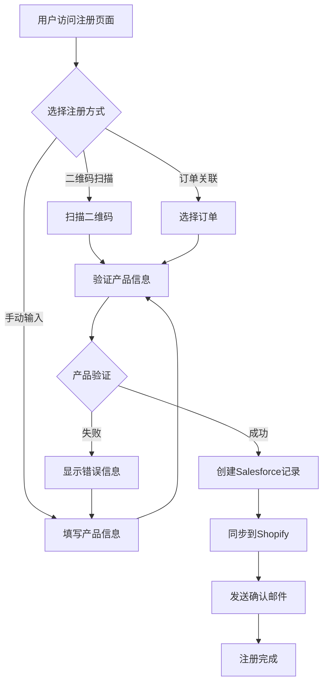
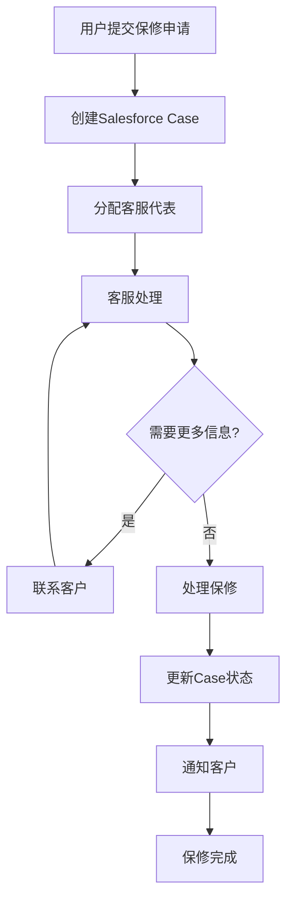

# Shokz Account Center - Salesforce Service Cloud Integration

## 🎯 业务需求分析

### Shokz的特殊情况
1. **多渠道销售** - 官网、代理商、第三方平台
2. **统一保修服务** - 所有渠道产品都享受保修
3. **Salesforce Service Cloud** - 现有客服和保修系统
4. **非官网购买** - 需要特殊的产品注册流程

## 🏗️ 技术架构设计

### 1. 系统集成架构

```
┌─────────────────┐    ┌─────────────────┐    ┌─────────────────┐
│   Shopify       │    │   Next.js       │    │   Salesforce    │
│   Storefront    │◄──►│   Account       │◄──►│   Service Cloud │
│                 │    │   Center        │    │                 │
└─────────────────┘    └─────────────────┘    └─────────────────┘
         │                       │                       │
         │                       │                       │
         ▼                       ▼                       ▼
┌─────────────────┐    ┌─────────────────┐    ┌─────────────────┐
│   Order Data    │    │   Product       │    │   Support       │
│   Customer Info │    │   Registration  │    │   Cases         │
│   Payment Info  │    │   Warranty      │    │   Knowledge     │
└─────────────────┘    └─────────────────┘    └─────────────────┘
```

### 2. 数据流设计

#### 产品注册流程
1. **用户输入产品信息** → Next.js Account Center
2. **验证产品真实性** → Salesforce Product API
3. **创建保修记录** → Salesforce Case Management
4. **同步到Shopify** → Customer Metafields

#### 保修申请流程
1. **用户提交保修申请** → Next.js Account Center
2. **创建Support Case** → Salesforce Service Cloud
3. **分配客服代表** → Salesforce Assignment Rules
4. **跟踪处理进度** → Real-time Case Updates

## 🔧 技术实现方案

### 1. Salesforce Service Cloud API集成

#### 认证方式
```javascript
// Salesforce OAuth 2.0 认证
const salesforceAuth = {
  clientId: process.env.SALESFORCE_CLIENT_ID,
  clientSecret: process.env.SALESFORCE_CLIENT_SECRET,
  username: process.env.SALESFORCE_USERNAME,
  password: process.env.SALESFORCE_PASSWORD,
  securityToken: process.env.SALESFORCE_SECURITY_TOKEN
}
```

#### API端点设计
```javascript
// 产品注册API
POST /api/salesforce/product-registration
{
  "productModel": "OpenRun Pro",
  "serialNumber": "SR2024001",
  "purchaseDate": "2024-01-15",
  "purchaseChannel": "Amazon",
  "customerId": "customer_123",
  "orderNumber": "AMZ-123456"
}

// 保修申请API
POST /api/salesforce/warranty-claim
{
  "productId": "product_123",
  "issueDescription": "Audio quality problem",
  "customerId": "customer_123",
  "priority": "high",
  "attachments": ["receipt.pdf", "video.mp4"]
}
```

### 2. 数据同步策略

#### 实时同步
- **产品注册** - 立即同步到Salesforce
- **保修申请** - 实时创建Support Case
- **状态更新** - Webhook推送更新

#### 批量同步
- **每日订单同步** - 从Shopify同步到Salesforce
- **客户信息更新** - 定期同步客户数据
- **产品信息同步** - 同步产品目录

### 3. 用户体验优化

#### 多渠道产品注册
```javascript
// 注册方式检测
const registrationMethods = {
  qrCode: {
    enabled: true,
    api: '/api/qr-scan',
    fallback: 'manual'
  },
  manual: {
    enabled: true,
    validation: 'salesforce-product-api',
    required: ['serialNumber', 'purchaseDate', 'purchaseChannel']
  },
  orderLink: {
    enabled: true,
    source: 'shopify-orders',
    autoFill: ['productModel', 'serialNumber', 'purchaseDate']
  }
}
```

#### 智能表单
```javascript
// 动态表单字段
const formFields = {
  purchaseChannel: {
    type: 'select',
    options: [
      'Shokz.com Official',
      'Amazon',
      'Best Buy',
      'Target',
      'Walmart',
      'Authorized Retailer',
      'Third-party Platform'
    ],
    conditional: {
      'Shokz.com Official': {
        show: ['orderNumber'],
        hide: ['receiptUpload']
      },
      'Third-party Platform': {
        show: ['receiptUpload'],
        required: ['receiptUpload']
      }
    }
  }
}
```

## 📊 数据模型设计

### 1. Salesforce对象设计

#### Product Registration对象
```javascript
{
  "Name": "Product Registration",
  "Fields": [
    "Product_Model__c",
    "Serial_Number__c",
    "Purchase_Date__c",
    "Purchase_Channel__c",
    "Customer__c",
    "Order_Number__c",
    "Warranty_Start_Date__c",
    "Warranty_End_Date__c",
    "Status__c"
  ]
}
```

#### Warranty Case对象
```javascript
{
  "Name": "Warranty Case",
  "Fields": [
    "Product_Registration__c",
    "Issue_Description__c",
    "Priority__c",
    "Status__c",
    "Assigned_To__c",
    "Resolution__c",
    "Customer__c"
  ]
}
```

### 2. Shopify Metafields设计

#### Customer Metafields
```javascript
{
  "registered_products": {
    "namespace": "shokz",
    "key": "registered_products",
    "type": "json",
    "value": [
      {
        "productId": "product_123",
        "serialNumber": "SR2024001",
        "registrationDate": "2024-01-16",
        "warrantyStatus": "active"
      }
    ]
  }
}
```

## 🔄 业务流程设计

### 1. 产品注册流程



### 2. 保修申请流程



## 🛡️ 安全性和合规性

### 1. 数据安全
- **API认证** - OAuth 2.0 + JWT
- **数据加密** - TLS 1.3 + AES-256
- **访问控制** - Role-based permissions
- **审计日志** - 完整的操作记录

### 2. 隐私保护
- **GDPR合规** - 数据删除和导出
- **CCPA合规** - 加州消费者隐私法
- **数据最小化** - 只收集必要信息
- **用户同意** - 明确的隐私政策

## 📈 性能优化

### 1. 缓存策略
```javascript
// Redis缓存配置
const cacheConfig = {
  productInfo: {
    ttl: 3600, // 1小时
    key: 'product:{{serialNumber}}'
  },
  warrantyStatus: {
    ttl: 1800, // 30分钟
    key: 'warranty:{{productId}}'
  },
  supportCases: {
    ttl: 300, // 5分钟
    key: 'cases:{{customerId}}'
  }
}
```

### 2. API优化
- **批量操作** - 减少API调用次数
- **分页加载** - 大量数据分页显示
- **异步处理** - 非关键操作异步执行
- **CDN加速** - 静态资源CDN分发

## 🚀 部署和监控

### 1. 部署策略
- **容器化部署** - Docker + Kubernetes
- **CI/CD流水线** - GitHub Actions
- **环境隔离** - Dev/Staging/Production
- **蓝绿部署** - 零停机更新

### 2. 监控和告警
- **应用监控** - New Relic/DataDog
- **错误追踪** - Sentry
- **性能监控** - Web Vitals
- **业务监控** - 注册成功率、保修处理时间

## 📋 实施计划

### Phase 1: 基础集成 (4周)
- [ ] Salesforce API集成
- [ ] 产品注册功能
- [ ] 基础保修管理

### Phase 2: 高级功能 (6周)
- [ ] 多渠道注册支持
- [ ] 智能表单
- [ ] 实时状态更新

### Phase 3: 优化和扩展 (4周)
- [ ] 性能优化
- [ ] 移动端优化
- [ ] 多语言支持

## 🔍 测试策略

### 1. 单元测试
- API端点测试
- 数据验证测试
- 业务逻辑测试

### 2. 集成测试
- Salesforce API集成测试
- Shopify API集成测试
- 端到端流程测试

### 3. 用户测试
- 多渠道注册流程测试
- 保修申请流程测试
- 移动端体验测试

## 📚 文档和维护

### 1. 技术文档
- API文档
- 部署指南
- 故障排除指南

### 2. 用户文档
- 产品注册指南
- 保修申请指南
- 常见问题解答

### 3. 维护计划
- 定期安全更新
- 性能监控和优化
- 功能迭代和升级

---

这个技术架构确保了Shokz能够为所有客户提供统一的产品注册和保修服务，无论他们从哪个渠道购买产品，同时与现有的Salesforce Service Cloud系统无缝集成。
